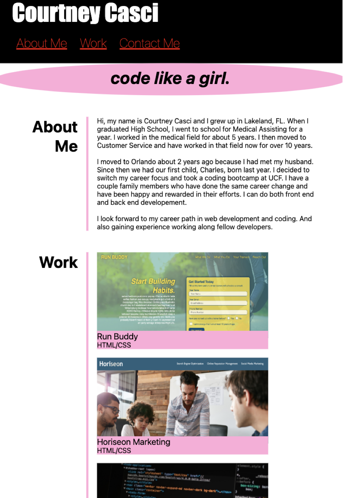

# My-Portfolio

## I created my portfolio as a reference to any future employers as an example of my developement and web design skills.

## I used HTML and CSS to create and style my page to my preference.

## I provided 2 projects I have worked on and created and when you click on the project image it takes you directly to those live projects.

## I also provided my contact info including my phone number, email address, GitHub, and my LinkedIn profile.

## I styled the page to be able to convert to most media screen resolutions.

## My goal is after learning more programming languages like JavaScript for example to be able to keep making futher improvements to my professional portfolio.

https://courtcoder.github.io/My-Portfolio/
